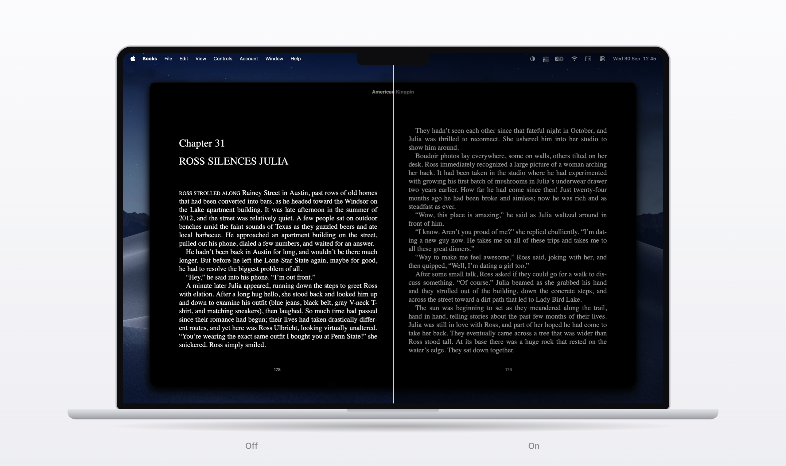

<h1 align="center">White Point</h1>

<p align="center">
  
</p>

On iOS and iPadOS, the **Reduce White Point** feature tones down bright colours so the screen is easier on your eyes. White Point brings the same idea to your Mac.

Even with the brightness dimmed, bright text can still feel harsh, especially at night. White Point dims everything on your main display by the same amount, on top of your usual brightness setting.

## Features

- **Adjustable intensity.** Drag the slider to choose how much to dim the screen.
- **Keyboard shortcut.** Turn White Point on or off from any app.
- **Schedules.** Turn it on and off at set times, at sunset and sunrise, or along with Night Shift. Sunrise and sunset are worked out on your Mac, and your location never leaves it.
- **Launch at login.** Start White Point automatically so your schedule keeps running.

## Requirements

- A Mac with Apple silicon
- macOS 13 Ventura or later
- Apple's command-line developer tools, to build the app

## Install

1. If you don't have Apple's command-line tools, install them:

   ```bash
   xcode-select --install
   ```

2. Clone this repository and build the app:

   ```bash
   git clone https://github.com/juleshall4/whitepoint.git
   cd whitepoint
   ./build.sh
   ```

3. Move **White Point.app** to your Applications folder, then open it.

White Point runs in the menu bar. It doesn't show a Dock icon or a window.

## Use

Click the White Point icon (◐) in the menu bar to open its controls.

- To dim the screen, select **Reduce white point**, then drag the slider.
- To set a shortcut, click **Choose shortcut…** and press a key combination that includes Control, Option, or Command.
- To set up a schedule, click **Schedule…**.
- To stop White Point and return your display to normal, click **Quit and restore display**.

> [!NOTE]
> Schedules only work while White Point is running. Turn on **Launch at login** if you want it to run every day.
